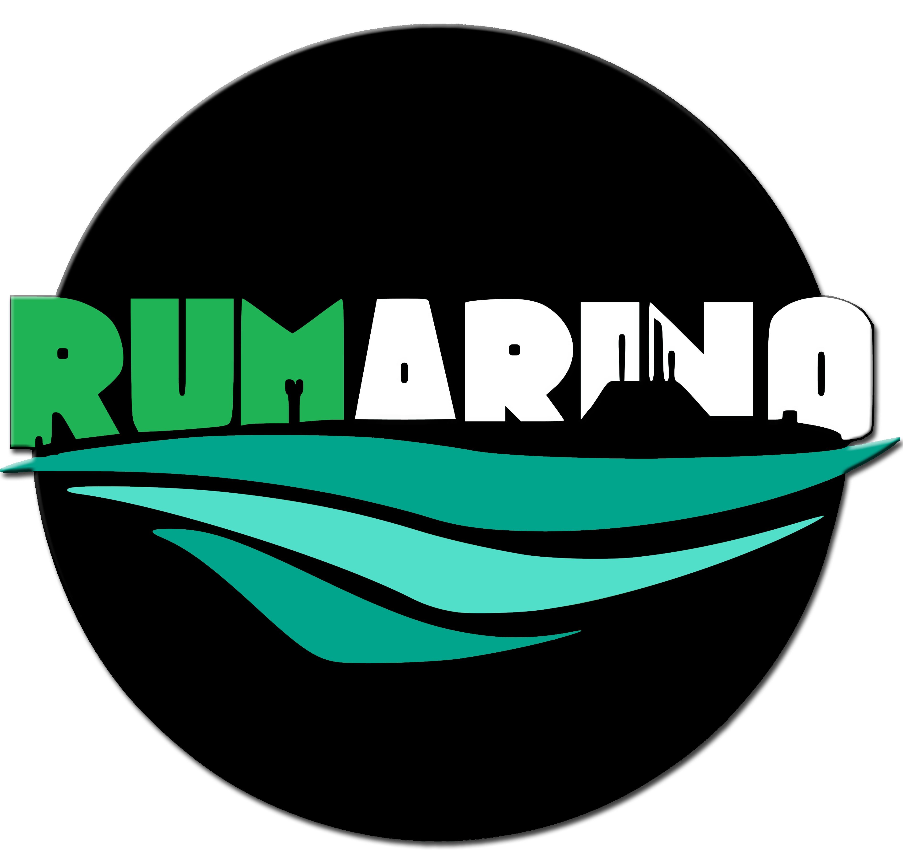

# Official Repository of RUMarino.

Arquitecture of the autonomous underwater vehicle and all its components.

## Installation

1. Create a ROS workspace.
2. If you have a *src* already, delete it.
3. With your favorite command interpreter, travel to the ROS workspace that you already created and copy the following command:    
`git clone https://gitlab.com/rumarino/src.git`
4. Build the the ROS workspace with the following command:   
`catkin_make`
5. Done.